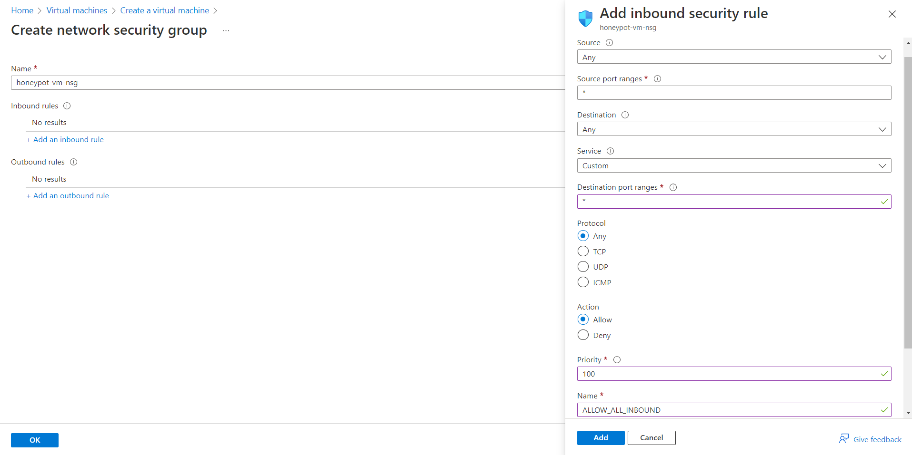
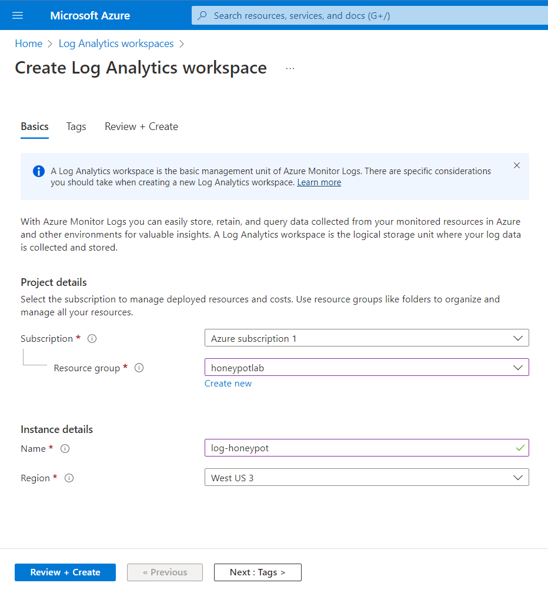
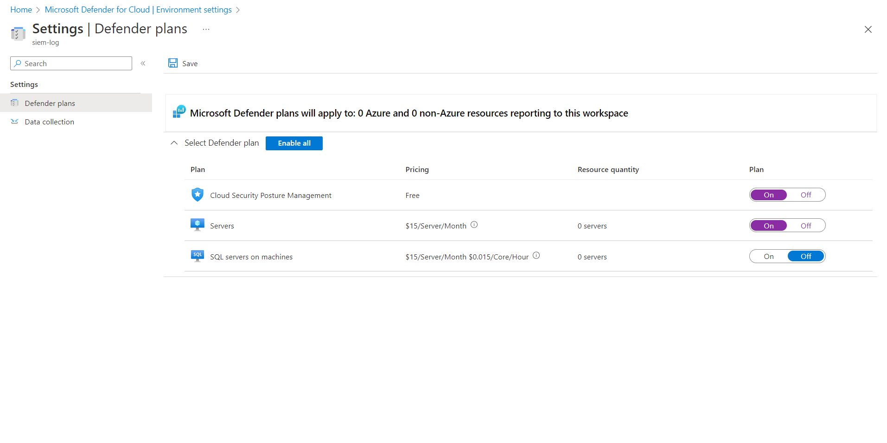
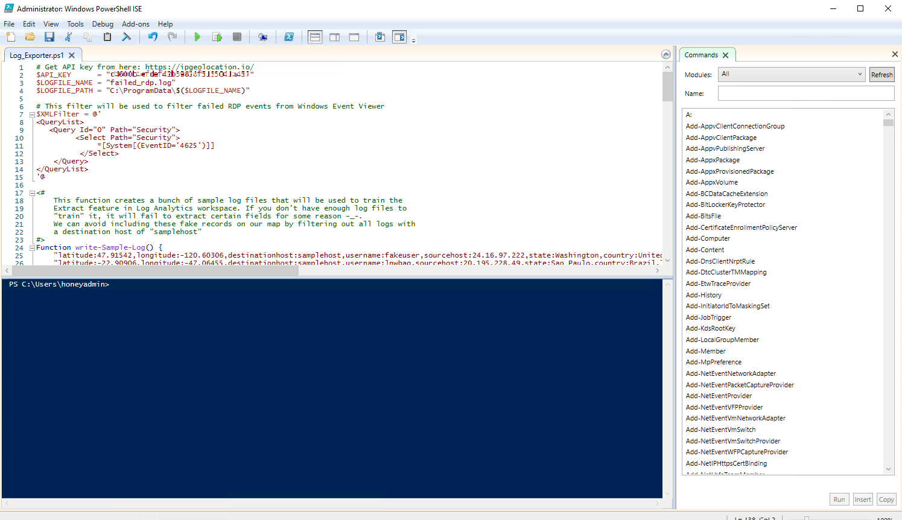
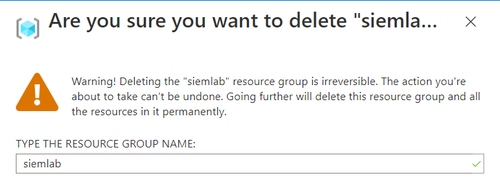

# SIEM & Honeypot | Microsoft Azure Sentinel Attack Map

### Summary
SIEM stands for Security Information and Event Management System. It is a solution that helps organizations detect, analyze, and respond to security threats before they harm business operations. It is a tool that collects event log data from a range of sources within a network such as Firewalls, IDS/IPS, Identity solutions, etc. This allows the security professionals to monitor, prioritize and remediate potential threats in real-time. A honeypot is a security mechanism that creates a virtual trap in a controlled and safe environment to lure attackers. An intentionally compromised computer system to study how attackers work and examine different types of threats and improve security policies. This lab will be to understand how to collect honeypot attack log data and display it in a world map.

### Learning Objectives:
- Configuration & Deployment of Azure resources such as virtual machines, Log Analytics Workspaces, and Azure Sentinel
- Hands-on experience and working knowledge of a SIEM Log Management Tool (Microsoft's Azure Sentinel)
- Understand Windows Security Event logs
- Utilization of KQL to query logs
- Display attack data on a dashboard with Workbooks (World Map)

### Tools & Requirements:

1. Microsoft Azure Subscription 
2. Azure Sentinel
3. Kusto Query Language (KQL - Used to build world map)
4. Network Security Groups (Layer 4/3 Firewall in Azure)
5. Remote Desktop Protocol (RDP)
6. 3rd Party API: [ipgeolocation.io](https://ipgeolocation.io/)
7. Custom [Powershell Script](https://github.com/joshmadakor1/Sentinel-Lab/blob/main/Custom_Security_Log_Exporter.ps1) written by Josh Madakor


### Overview:


## Step 1: Create a Microsoft Azure Subscription: [Azure](https://azure.microsoft.com/en-us/free/)
> Free 200$ Credit for 30 days


## Step 2: Create a Honeypot Virtual Machine
> Exposed Windows VM


### Basics

- Go to `portal.azure.com`
- Search for "virtual machines" 
- Create > Azure virtual machine
#### Project details
- Create new resource group and name it (honeypotlab)
> A resource group is a collection of resources that share the same lifecycle, permissions, and policies.
#### Instance details
- Name your VM (honeypot-vm)
- Select a recommended region ((US) East US 2)
- Availability options: No infrastructure redundancy required
- Security type: Standard
- Image: Windows 10 Pro, version 21H2 - x62 Gen2
- VM Architecture: x64
- Size: Default is okay (Standard_D2s_v3 – 2vcpus, 8 GiB memory)
#### Administrator account
- Create a username and password for virtual machine
> IMPORTANT NOTE: These credentials will be used to log into the virtual machine (Keep them handy)
#### Inbound port rules
- Public inbound ports: Allow RDP (3389)
#### Licensing
- Confirm licensing 
- Select **Next : Disks >**


### Disks 
- Leave all defaults
- Select **Next : Networking >**

### Networking
#### Network interface
- NIC network security group: Advanced > Create new
> A network security group contains security rules that allow or deny inbound network traffic to, or outbound network traffic from, the virtual machine. In other words, security rules management.
- Remove Inbound rules (1000: default-allow-rdp) by clicking three dots
- Add an inbound rule
- Destination port ranges: * (wildcard for anything)
- Protocol: Any
- Action: Allow
- Priority: 100 (low)
- Name: Anything (ALLOW_ALL_INBOUND)
- Select **Review + create**



> Configuring the firewall to allow traffic from anywhere will make the VM easily discoverable.

## Step 3: Create a Log Analytics Workspace
- Search for "Log analytics workspaces"
- Select **Create Log Analytics workspace**
- Put it in the same resource group as VM (honeypotlab)
- Give it a desired name (honeypot-log)
- Add to same region (East US 2)
- Select **Review + create**



> The Windows Event Viewer logs will be ingested into Log Analytics workspaces in addition to custom logs with geographic data to map attacker locations.

## Step 4: Configure Microsoft Defender for Cloud
- Search for "Microsoft Defender for Cloud"
- Scroll down to "Environment settings" > subscription name > log analytics workspace name (log-honeypot)


#### Settings | Defender plans
- Cloud Security Posture Management: ON
- Servers: ON
- SQL servers on machines: OFF
- Hit **Save**



#### Settings | Data collection
- Select "All Events" 
- Hit **Save**

## Step 5: Connect Log Analytics Workspace to Virtual Machine
- Search for "Log Analytics workspaces"
- Select workspace name (log-honeypot) > "Virtual machines" > virtual machine name (honeypot-vm)
- Click **Connect**


## Step 6: Configure Microsoft Sentinel
- Search for "Microsoft Sentinel"
- Click **Create Microsoft Sentinel**
- Select Log Analytics workspace name (honeypot-log)
- Click **Add**


## Step 7: Disable the Firewall in Virtual Machine
- Go to Virtual Machines and find the honeypot VM (honeypot-vm)
- By clicking on the VM copy the IP address
- Log into the VM via Remote Desktop Protocol (RDP) with credentials from step 2
- Accept Certificate warning
- Select NO for all **Choose privacy settings for your device**
- Click **Start** and search for "wf.msc" (Windows Defender Firewall)
- Click "Windows Defender Firewall Properties"
- Turn Firewall State OFF for **Domain Profile** **Private Profile** and **Public Profile**
- Hit **Apply** and **Ok**
- Ping VM via Host's command line to make sure it is reachable `ping -t <VM IP>`


## Step 8: Scripting the Security Log Exporter
- In VM open Powershell ISE
- Set up Edge without signing in
- Copy [Powershell script](https://github.com/joshmadakor1/Sentinel-Lab/blob/main/Custom_Security_Log_Exporter.ps1) into VM's Powershell (Written by Josh Madakor)
- Select **New Script** in Powershell ISE and paste script
- Save to Desktop and give it a name (Log_Exporter)



- Make an account with [Free IP Geolocation API and Accurate IP Lookup Database](https://ipgeolocation.io/)
> This account is free for 1000 API calls per day. Paying 15.00$ will allow 150,000 API calls per month.
- Copy API key once logged in and paste into script line 2: `$API_KEY = "<API key>"`
- Hit **Save**
- Run the PowerShell ISE script (Green play button) in the virtual machine to continuously produce log data


> The script will export data from the Windows Event Viewer to then import into the IP Geolocation service. It will then extract the latitude and longitude and then create a new log called failed_rdp.log in the following location: C:\ProgramData\failed_rdp.log

## Step 9: Create Custom Log in Log Analytics Workspace
- Create a custom log to import the additional data from the IP Geolocation service into Azure Sentinel
- Search "Run" in VM and type "C:\ProgramData"
- Open file named "failed_rdp" hit **CTRL + A** to select all and **CTRL + C** to copy selection
- Open notepad on Host PC and paste contents
- Save to desktop as "failed_rdp.log"
- In Azure go to Log Analytics Workspaces > Log Analytics workspace name (honeypot-log) > Custom logs > **Add custom log**
#### Sample
- Select Sample log saved to Desktop (failed_rdp.log) and hit **Next**
#### Record delimiter
- Review sample logs in Record delimiter and hit **Next** 
#### Collection paths
- Type > Windows
- Path > "C:\ProgramData\failed_rdp.log"
#### Details
- Give the custom log a name and provide description (FAILED_RDP_WITH_GEO) and hit **Next**
- Hit **Create**


## Step 10: Query the Custom Log
- In Log Analytics Workspaces go to the created workspace (honeypot-log) > Logs
- Run a query to see the available data (FAILED_RDP_WITH_GEO_CL)
> May take some time for Azure to sync VM and Log Analytics


## Step 11: Extract Fields from Custom Log 
> The RawData within a log contains information such as latitude, longitude, destinationhost, etc. Data will have to be extracted to create separate fields for the different types of data
- Right click any of the log results
- Select **Extract fields from 'FAILED_RDP_WITH_GEO_CL'**
- Highlight ONLY the value after the ":" 
- Name the **Field Title** the name of the field of the value
- Under **Field Type** select the appropriate data type
- Hit **Extract**
- If the search results data looks good click the **Save extraction** button
- Do this for ALL available fields in RawData
> NOTE: If one of the search results is not correct select **Modify this highlight** (upper right corner of result) and highlight the correct value. Otherwise go to **Custom logs > Custom fields** Accept warning of unsaved edits and delete field. Redo extraction for deleted field.


## Step 12: Map Data in Microsoft Sentinel
- Go to Microsoft Sentinel to see the Overview page and available events
- Click on **Workbooks** and **Add workbook** then click **Edit**
- Remove default widgets (Three dots > Remove)
- Click **Add > Add query** 
- Copy/Paste the following query into the query window and **Run Query**

```KQL
FAILED_RDP_WITH_GEO_CL | summarize event_count=count() by sourcehost_CF, latitude_CF, longitude_CF, country_CF, label_CF, destinationhost_CF
| where destinationhost_CF != "samplehost"
| where sourcehost_CF != ""
```
> Kusto Query Language (KQL) - Azure Monitor Logs is based on Azure Data Explorer. The language is designed to be easy to read and use with some practice writing queries and basic guidance.

- Once results come up click the **Visualization** dropdown menu and select **Map**
- Select **Map Settings** for additional configuration
#### Layout Settings
- **Location info using** > Latitude/Longitude
- **Latitude** > latitude_CF
- **Longitude** > longitude_CF
- **Size by** > event_count
#### Color Settings
- **Coloring Type:** Heatmap 
- **Color by** > event_count
- **Aggregation for color** > Sum of values
- **Color palette** > Green to Red
#### Metric Settings
- **Metric Label** > label_CF
- **Metric Value** > event_count
- Select **Apply** button and **Save and Close**
- Save as "Failed RDP World Map" in the same region and under the resource group (honeypotlab)
- Continue to refresh map to display additional incoming failed RDP attacks
> NOTE: The map will only display Event Viewer's failed RDP attempts and not all the other attacks the VM may be receiving.


> Event Viewer Displaying Failed RDP logon attemps. EventID 4625


> Custom Powershell script parsing data from 3rd party API


## Step 13: Deprovision Resources
> VERY IMPORTANT - Do NOT skip!
- Search for "Resource groups" > name of resource group (honeypotlab) > **Delete resource group**
- Type the name of the resource group ("honeypotlab") to confirm deletion
- Check the **Apply force delete for selected Virtual machines and Virtual machine scale sets** box
- Select **Delete**



> If resources are not deleted they will eat up the free credits and fees may start to accumulate.
